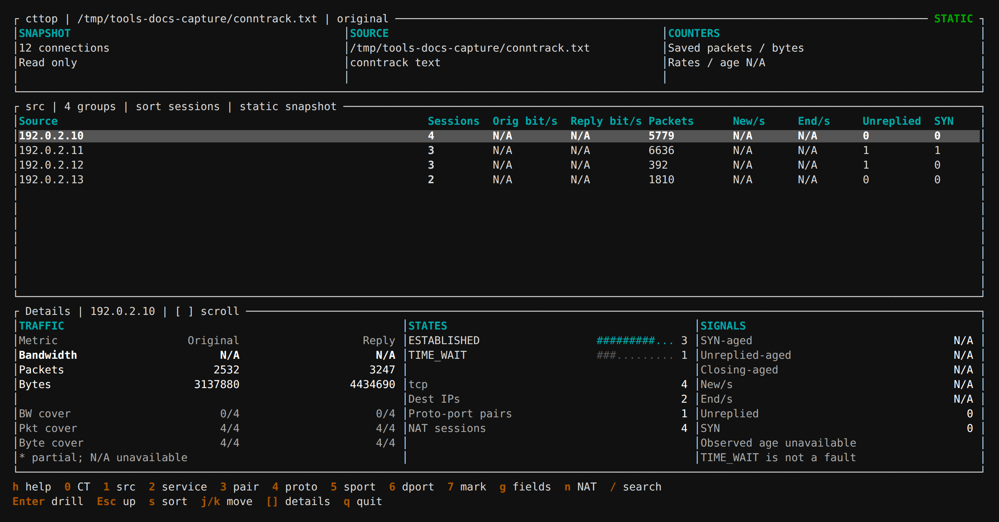

# cttop

Inspect Linux conntrack connections, traffic and anomaly signals, with grouped drilldown, NAT views and offline file analysis.

[](../../assets/screenshots/cttop-static.png)

## Installation

Example for x86_64; see [cttop-release](https://github.com/calcky/tools/releases/tag/cttop-release) for other architectures.

```sh
curl -fLO https://github.com/calcky/tools/releases/download/cttop-release/cttop-linux-x86_64
mkdir -p "$HOME/.local/bin"
install -m 755 cttop-linux-x86_64 "$HOME/.local/bin/cttop"
```

Static sample using documentation addresses. Saved packets/bytes are available; bandwidth and change rates remain `N/A`.

## Common Commands

```sh
# Group by original source IP
cttop

# One connection per row
cttop -g none

# Group by mark/source or destination service
cttop -g mark,src
cttop -g dst,dport,proto

# Filter TCP 443, or inspect translated endpoints
cttop -p tcp -D 443
cttop -N -g src,sport

# Three periodic text reports
cttop -b -c 3

# Analyze one current conntrack snapshot and exit
cttop summary

# Export and load a snapshot, or read from a pipe
conntrack -L -o extended > conntrack.txt
cttop -f conntrack.txt
cttop summary -f conntrack.txt
conntrack -L | cttop -f
conntrack -L | cttop summary -f
```

## Key Options

| Option | Meaning |
| --- | --- |
| `summary` | Analyze one snapshot and exit; `--summary` remains accepted |
| `-g FIELDS` | Group by `src,sport,dst,dport,proto,zone,mark`; `none` lists individual connections |
| `-N` | Show translated forward endpoints |
| `-s IP` / `-d IP` | Original source / destination IP filter |
| `-S PORT` / `-D PORT` | Original source / destination port filter |
| `-p PROTO` | Protocol filter, such as `tcp` or `udp` |
| `-f [FILE]` | Load a conntrack text snapshot; omitted filename or `-` reads stdin |
| `-i SEC` | Display interval; default 1 second |
| `-r SEC` | Full calibration and bandwidth sampling interval; default 5 seconds |
| `-m N` | Minimum live sessions per group; default 0 |
| `-b` / `-c N` | Text reports / report count |
| `-h` / `-v` | Help / version |

## Reading Results

Live views show connection counts, states, original/reply bandwidth, packet/byte counters,
and lifecycle or kernel-drop signals. Drill into a port group with Enter, then regroup by another field.

Packet and byte counters require kernel conntrack accounting; missing counters show `N/A`.
Bandwidth uses byte differences between samples. Partial coverage is explicit;
missing data is not treated as zero traffic.

`summary` reports protocol and TCP-state distributions, top sources,
destinations, services and marks, plus NAT and unreplied signals. Packet and
byte totals show counter coverage; live snapshots also include kernel table
occupancy and cumulative failure/drop counters. A single snapshot cannot infer
bandwidth, creation rates or connection age. `summary` accepts `-N` and connection
filters, but not periodic-report or grouping options (`-b/-c/-g/-i/-r/-W/-m`).

## Window Keys

| Key | Action |
| --- | --- |
| `0` | One connection per row |
| `1`..`7` / `g` | Select grouping / edit the field list |
| Enter / Esc | Drill down / return one level |
| `n` | Toggle original and NAT views |
| `/` / `s` | Search / change sorting |
| Arrows, `j/k` | Select a row |
| `h` / `q` | Help / quit |

## Notes

Live monitoring needs `CAP_NET_ADMIN` in the target network namespace; offline file analysis does not.
Offline analysis needs no root. A static snapshot can show recorded counters and states,
but cannot calculate bandwidth, creation rates or connection age.
Command-line IP/port filters always match original tuples, including in the NAT view.
The tool is read-only; it does not change firewall rules or enable accounting automatically.

[Full manual](https://github.com/calcky/tools/blob/master/cttop/README.md)
