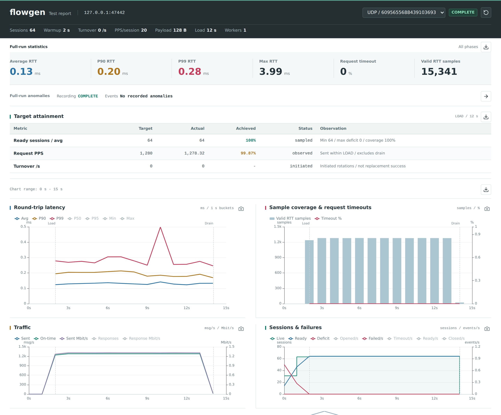

# flowgen

Generate multi-session TCP/UDP load with a paired echo server, record request/response measurements, and produce offline RTT and HTML time-series reports.

## Installation

Example for x86_64; see [flowgen-release](https://github.com/calcky/tools/releases/tag/flowgen-release) for other architectures.

```sh
curl -fLO https://github.com/calcky/tools/releases/download/flowgen-release/flowgen-linux-x86_64
mkdir -p "$HOME/.local/bin"
install -m 755 flowgen-linux-x86_64 "$HOME/.local/bin/flowgen"
```

## Common Commands

Start the server on the target:

```sh
flowgen -s -p 11112 -w 4 -o results/server-1
```

Fixed sessions: warm up to 100 sessions over 2 seconds, then send 20 PPS per session for 10 seconds.

```sh
flowgen -u -c 100 -a 2 -r 20 -T 10 -w 1 \
  -P 20000-29999 -o results/fixed-1 192.168.0.1
```

TCP churn: after reaching 100 sessions, replace 20 sessions per second.

```sh
flowgen -t -c 100 -a 2 -U 20 -r 20 -T 10 -w 1 \
  -P 20000-29999 -o results/churn-1 192.168.0.1
```

Re-analyze recordings without generating traffic:

```sh
flowgen -R results/churn-1
```

## Key Options

| Option | Meaning |
| --- | --- |
| `-s` | Server: TCP control and TCP/UDP data on one port |
| `-t` / `-u` | TCP / UDP client; choose one |
| `-c N` | Target sessions; default 1000 |
| `-a SEC` | Warmup duration; default 10 seconds |
| `-U RATE` | Session replacements per second after warmup; default 0 |
| `-r PPS` | Requests per second per ready session; default 10 |
| `-l BYTES` | Application message length including the header; default 128 bytes |
| `-T SEC` | Load duration excluding warmup; default 60 seconds; `0` runs until stopped |
| `-W SEC` | Setup, request and drain timeout; default 1 second |
| `-w N` | Worker count |
| `-B IP` / `-P LOW-HIGH` | Source IP (repeatable) / source port pool |
| `-Q SEC` | Explicitly allow tuple reuse after cooldown; no reuse by default |
| `-L MODE` | Recording: `events` (default), `summary`, or `off` |
| `-o DIR` / `-R DIR` | Recording directory / offline analysis directory |
| `-p PORT` | Server port; default 11112 |
| `-4` / `-6` | IPv4 (default) / IPv6 |
| `-h` / `-v` | Help / version |

## Reports

[](../../assets/screenshots/flowgen-report.png)

Loopback run: 64 UDP sessions, 20 PPS per session, 12-second load. This illustrates the report, not a capacity limit.

With the default `events` recording mode, the client analyzes the run automatically and creates `report.html` in the output directory.
Open it directly in a browser; no server or internet connection is needed.
The report includes RTT Avg/P90/P99 time series, ready sessions, traffic rates, bandwidth and diagnostic counters; CSV files retain the analysis data.

`-R` prints summary, latency and diagnostic tables. RTT is a full round trip.
Reordering is per session; jitter is the absolute RTT difference between adjacent successful request sequences in that session.

## Notes

- Use a fresh `-o` directory for every run.
- Traffic starts only after all initial sessions are ready. Target request rate is `N * r`, not wire PPS.
- Requests and responses have equal application lengths. TCP may segment/coalesce; UDP may fragment.
- Fresh tuples are preferred and reuse is disabled by default. Configure source IPs first. For churn, provision at least `N + ceil(U * T)` source IP/port combinations, plus failure headroom.
- `limited` and `skipped` mean local capacity or scheduling limits, not packet loss. TCP timeouts are not a network packet-loss percentage either.
- Capacity depends on descriptors, memory and the port pool. The tool does not change sysctls or configure IP addresses.

[Full manual](https://github.com/calcky/tools/blob/master/flowgen/README.md)
