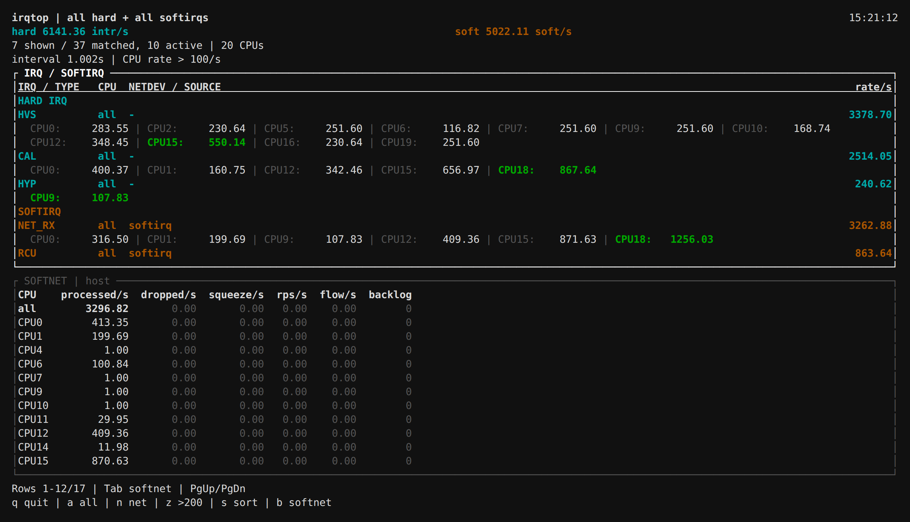

# irqtop / irqstat

Inspect Linux hardware IRQ, softirq and softnet rates and CPU distribution.
irqtop is a live window; irqstat prints periodic text reports.

[](../../assets/screenshots/irqtop-window.png)

Actual `irqtop -a -m 100 -b` window: interrupt totals, per-CPU rates and softnet together.

## Common Commands

```sh
# All hardware IRQs and softirqs
irqtop

# Network interrupts and softnet
irqtop -n -b

# Select one or multiple interfaces
irqtop -i eth0,eth1

# Select a VF label
irqtop -i xnic0/vf1

# Show CPUs strictly above 500/s
irqtop -n -m 500

# Five one-second reports; hardware IRQs only by default
irqstat -n 1 5

# Include network softirqs, or record unfiltered output
irqstat -i eth0 -s 1 5
irqstat -m 0 1 60 > irq.log
```

## Key Options

| Option | Meaning |
| --- | --- |
| `-a` | All hardware IRQs; all softirqs when enabled |
| `-n` | Network hardware IRQs; NET_RX/NET_TX when enabled |
| `-i NIC[,NIC]` | Exact interfaces or `PF/vfN` labels; implies `-n` |
| `-s` | Include softirqs in irqstat; already enabled in irqtop |
| `-b` | Add softnet processing, drop and budget-exhaustion counters |
| `-m RATE` | Show CPUs strictly above the threshold; default 200/s; `0` disables filtering |
| `-z` | Show every non-zero interrupt source |
| `-d` | Interval counts instead of rates |
| `interval [count]` | Sampling interval in seconds and report count |
| `-h` / `-v` | Help / version |

## Reading Results

- `CPU=all` is the interrupt total, including CPUs hidden by the threshold.
- A source is hidden if no CPU exceeds the threshold, regardless of its total.
- The busiest CPU values are bold and highlighted. `rate/s` is an interval-average rate.
- Softnet `dropped/s` counts receive-backlog drops; `squeeze/s` counts exhausted processing budgets, not drops.

## Window Keys

| Key | Action |
| --- | --- |
| `a` / `n` | All / network interrupts |
| `z` | Toggle the default threshold and non-zero activity |
| `b` / `Tab` | Show softnet / select the scrolling area |
| `s` | Change sorting |
| Arrows, `j/k` | Move; PgUp/PgDn to page |
| `q` / Ctrl+C | Quit |

## Notes

IRQ/s is neither PPS nor CPU utilization. NET_RX/NET_TX and softnet are host-wide;
`-i` cannot attribute them to an interface.
VF labels report host-visible interrupts, not guest IRQs or guest CPU distribution.
Selecting a PF does not select its VFs. The tools are read-only and do not change IRQ affinity or system settings.

[Static downloads](https://github.com/calcky/tools/releases/tag/irqtop-release) · [Full manual](https://github.com/calcky/tools/blob/master/irqtop/README.md)
