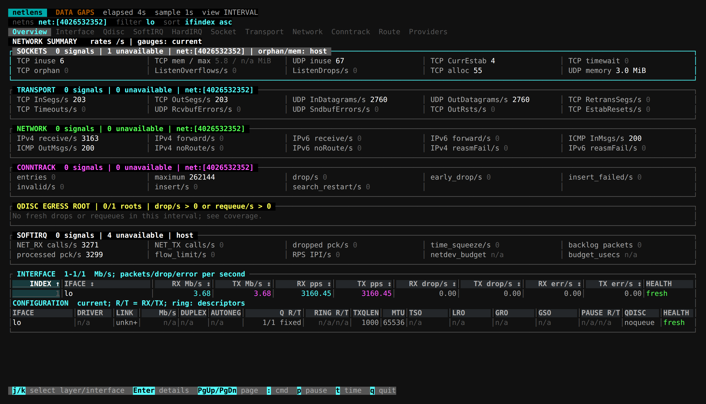

# netlens

Inspect Linux network traffic, errors, drops and resource pressure by layer, then drill down into connections, interfaces or protocols.

## Installation

Example for x86_64; see [netlens-release](https://github.com/calcky/tools/releases/tag/netlens-release) for other architectures.

```sh
curl -fLO https://github.com/calcky/tools/releases/download/netlens-release/netlens-linux-x86_64
mkdir -p "$HOME/.local/bin"
install -m 755 netlens-linux-x86_64 "$HOME/.local/bin/netlens"
```

## Start

```sh
netlens
netlens -i eth0,eth1 -d 0.5
```

The default sample interval is one second. `-d` accepts 0.25–60 seconds; `-i` filters interface-labelled rows without changing host or namespace totals.
Run `netlens --help` for options.

Select a layer or interface in Overview and press Enter for details; Esc returns. Commands such as `netlens socket` open a page directly.

[](../../assets/screenshots/netlens-overview.png)

Loopback traffic in an isolated network namespace. Missing sources retain their actual status instead of appearing as zero.

## Key Options

| Option | Meaning |
| --- | --- |
| `-d SEC` | Sample interval; default 1 second, range 0.25–60 seconds |
| `-i IFACES` | Filter interface-labelled rows, comma-separated; host totals stay unchanged |
| `overview/interface/socket/...` | Open a page directly |
| `-h` / `-V` | Help / version |

## Choose By Task

| Investigate | Read | Open Directly |
| --- | --- | --- |
| Application connections, TCP RTT and retransmissions | [Connections And Processes](docs/cli.md) | `netlens socket` |
| Interface traffic, queues, drops and CPU interrupts | [Interfaces, Queues And IRQs](docs/interfaces.md) | `netlens interface` |
| NAT, connection tracking, routes and neighbours | [Routing And Conntrack](docs/routing.md) | `netlens conntrack` / `route` |
| Units, totals, permissions or missing data | [Metrics And Data Status](docs/monitor-metrics.md) | `netlens providers` |
| How XDP, TC and the stack fit together | [Packet Paths](docs/packet-path.md) | Reference guide |

## Basic Controls

| Key | Action |
| --- | --- |
| Tab / Shift+Tab | Change pages |
| Arrows, `j/k` | Select or scroll |
| Enter / Esc | Open details / return |
| `s` / `r` | Change sort field / reverse sorting |
| `/` / Ctrl+U | Filter connections / clear the filter |
| PgUp/PgDn / Home | Page / return to the first row |
| `a` | Show zero/unavailable fields in supported details |
| `t` | Switch interval values and since-baseline totals |
| Space / `p` | Pause display; collection continues |
| `q` / Ctrl+C | Quit |

Press `:` and enter a page name, such as `:softirq` or `:providers`, to switch directly.
The first connection-row click selects it; the second opens details. Clicking a sortable heading again reverses sorting.

## Before You Start

The tool is read-only: no capture, BPF loading or network configuration changes. It observes the current network namespace; host-wide metrics are labelled separately.
Process and device visibility depends on permissions; elevated privileges cannot supply unsupported kernel or driver fields.
`n/a` is not zero. Check Providers when data is missing or stale.

[Full manual](https://github.com/calcky/tools/blob/master/netlens/README.md)
