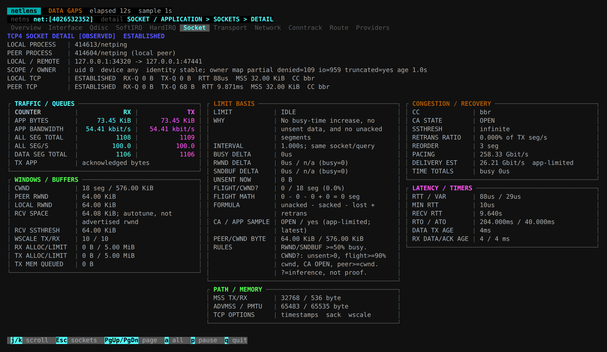

# Connections And Processes

## Find A Connection

```sh
netlens socket
```

Press `/` to filter, Ctrl+U to clear, Enter for details and Esc to return.

```text
proc cc-switch
port 15722
tcp and (port 443 or port 8443)
src net 192.168.0.0/24
ip6 and host ::1
```

`proc` is a standalone, case-insensitive process-name substring selector. Do not mix it with IP expressions.
Names come from `/proc/<pid>/comm`, normally limited to 15 bytes, not full command lines. Unresolved names do not match.

IP predicates include `host/net/port/portrange`, protocols, `src/dst`, `and/or/not` and parentheses, without DNS resolution.
`and` and `or` have equal precedence and associate left to right; group complex conditions explicitly.
Socket `src/dst` means local/remote, not connection initiator/acceptor.

## See Both Local Owners

A TCP connection between two local applications becomes one row:

```text
LOCAL              REMOTE             PROCESS
127.0.0.1:15722     127.0.0.1:48000     123/cc-switch <-> 456/codex
```

LOCAL uses stable endpoint ordering, not client/server roles. Filtering does not reverse it.
List queues and RTT belong to LOCAL, not both sockets combined. Details show the two owners and available diagnostics separately.
Pairing requires a unique reverse socket in the same namespace; listener ownership is not guessed for a connection.
UNIX pairing uses kernel peer-inode references. UDP peer ownership is not inferred from a port.

When a name is missing, inspect its ownership status:

| Status | Meaning |
| --- | --- |
| `resolving` | Awaiting a process scan |
| `unmatched` | Scanned without a matching FD |
| `restricted` | Some processes were unreadable |
| `partial` | Other scan errors or capacity limits |
| `denied` / `unavailable` | Scanning itself failed |

A short connection may close before sampling or scanning; a missing name does not mean it had no owner.

## Diagnose Slow TCP

[](../../../assets/screenshots/netlens-tcp.png)

Actual loopback connection: both owners, traffic, windows, congestion control and latency. Kernel RTT is not application RTT.

Open details and start with application traffic, RTT and retransmissions, then examine congestion and flow control.

| Metric | Interpretation |
| --- | --- |
| RTT | Kernel TCP RTT estimate, not application request latency |
| MSS | Current send-segment payload size, not MTU |
| `snd_cwnd` | Congestion window, usually in segments; multiply by MSS for bytes |
| `snd_wnd` | Peer-advertised receive window limiting local sending |
| `rcv_wnd` / `rcv_space` | Local receive window / receive-autotuning estimate; distinct values |
| `app` / `acked-app` | Received / acknowledged sent application bytes |
| `all-seg` | All TCP segments, including control traffic; not application messages |
| Retransmissions | Transport retries, not a directional packet-loss percentage |

`LIMIT BASIS` calculates constrained percentages from busy-time deltas, not wall-clock sample duration.
The 50% dominant-limit threshold and `CWND?`/`APP?` labels are heuristics, not proof of a bottleneck.
`ACTIVE` means no dominant timed limit was observed. Listeners show pending/backlog counts, not connection RTT.

## Other Sockets And Queues

Use standalone `/` selectors such as `unix`, `netlink`, `vsock` or `xdp`; `path=/run/` filters UNIX paths.
RAW, DCCP, SCTP, MPTCP, PACKET, TIPC and available subtypes are also supported.
This covers `ss` socket families, not every `ss` option; diagnostics depend on the kernel.

| Type | RECV-Q / SEND-Q Scope |
| --- | --- |
| TCP | Payload bytes; listeners show pending connections / backlog limit |
| UDP, RAW | Allocated queue memory, not just payload |
| UNIX stream | Receive bytes / allocated send memory |
| UNIX datagram | RECV-Q is the next datagram size |
| PACKET, NETLINK | Allocated memory |
| TIPC | Packets |
| VSOCK, XDP | Occupancy unavailable; ring capacity is not occupancy |

RAW displays IP protocol numbers rather than fabricated ports. Its procfs fallback lacks a stable cookie and does not promise cached attribution.
AF_XDP queue IDs, UMEM, ring settings and available errors are not XDP-program action counters.
See [Packet Paths](packet-path.md#xdp) for its receive/transmit path.
