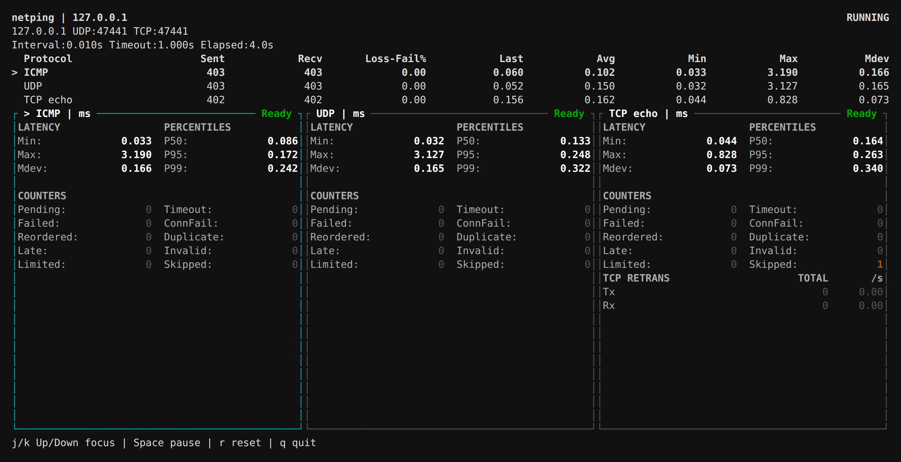

# netping

Measure ICMP, UDP/TCP echo and TCP connection latency, with a three-protocol live window and MTU/MSS inspection.

[](../../assets/screenshots/netping-window.png)

## Installation

Example for x86_64; see [netping-release](https://github.com/calcky/tools/releases/tag/netping-release) for other architectures.

```sh
curl -fLO https://github.com/calcky/tools/releases/download/netping-release/netping-linux-x86_64
mkdir -p "$HOME/.local/bin"
install -m 755 netping-linux-x86_64 "$HOME/.local/bin/netping"
```

Loopback test at 100 PPS per protocol. Values illustrate the UI, not cross-host performance.

## Common Commands

```sh
# ICMP, one probe per second
netping 192.168.0.1

# Run the UDP/TCP echo server on the target
netping -s

# UDP echo and TCP echo on a persistent connection
netping -u -c 20 192.168.0.1
netping -t -c 20 192.168.0.1

# Ten independent sessions to one target, each at one PPS
netping -t -j 10 -r 1 192.168.0.1
netping -u -j 10 -r 1 192.168.0.1

# Connection time to an ordinary TCP service
netping -C -p 443 192.168.0.1

# Three-protocol window; replace TCP echo with connection tests on 443
netping -w 192.168.0.1
netping -w -C -P 443 192.168.0.1

# Performance mode: 1000 PPS for 10 seconds
netping -u -b -r 1000 -T 10 192.168.0.1

# Path MTU and TCP MSS
netping -M 192.168.0.1
netping -S -p 443 192.168.0.1
```

## Key Options

| Option | Meaning |
| --- | --- |
| `-u` / `-t` / `-C` | UDP echo / TCP echo / TCP connect; default ICMP |
| `-s` | Serve UDP and TCP together; default port 11111 |
| `-j N` | Independent sessions per protocol, 1–256 (default 1); not with `-s/-M/-S` |
| `-w` | Live ICMP, UDP and TCP statistics and details |
| `-p PORT` | Destination or listening port; default 11111 |
| `-P PORT` | Override only the window's TCP port, not UDP |
| `-c N` / `-T SEC` | Count / sending duration; stop at whichever comes first |
| `-i SEC` / `-r PPS` | Interval / rate; mutually exclusive |
| `-W SEC` | Per-request timeout; default 1 second |
| `-l BYTES` | Application payload including the test header; default 64 bytes |
| `-b` / `-f` | Performance mode / continuous single-request ping-pong; `-f` requires `-b` |
| `-M` / `-S` | Path MTU / TCP MSS inspection |
| `-4` / `-6` | IPv4 (default) / IPv6 |
| `-h` / `-v` | Help / version |

## Reading Results

Text mode prints each reply RTT or timeout, then summarizes sent, received,
timeout, reordered, duplicate and late replies.
RTT is in milliseconds: `rtt min/avg/max/mdev = ...`, with P50/P95/P99 percentiles on a separate line.
Performance mode reports PPS, application bandwidth and RTT distribution every second.

With `-j`, rate, interval and count apply per session; `-T` is the common sending duration.
TCP echo uses independent persistent connections, UDP uses distinct source ports,
and ICMP uses logical streams with distinct Echo IDs; `-C` runs independent connect schedules.
Text replies include a session ID. Totals combine all samples; the final session table
shows local endpoint, sent/received, failure/timeout, pending, mean and P95/P99.
Overall RTT is weighted by successful samples, with percentiles from merged histograms.
A failed session does not stop the others. Bounded history is retained per session,
so memory grows with `-j`; use `flowgen` for large connection load tests.

ICMP/UDP report probe loss; TCP reports request failures/timeouts, not network packet loss.
TCP echo RTT excludes the initial connection. `-C` explicitly measures connection time.

## Window Keys

Arrows or `j/k` select a protocol; Space pauses/resumes sending, `r` restarts,
and `q` or Ctrl+C quits. Pending requests still complete or time out while paused.
Each protocol's summary is printed on exit.
`-w -j N` creates N sessions per protocol. Press `s` to toggle the selected protocol's
totals/session details, and `j/k` to select a session. Pause/reset apply to all sessions;
exit prints protocol totals and session tables.

## Notes

- UDP/TCP echo needs `netping -s`; ICMP and ordinary TCP connection tests do not.
- If ICMP permission is denied, configure `CAP_NET_RAW` or the system's ping socket permissions.
- An exact MTU requires explicit Too Big evidence and a verified reachable size. A timeout may be loss or filtered ICMP.
- MSS counts TCP payload bytes, not IP MTU. TCP options can reduce send MSS below the handshake advertisement.

[Full manual](https://github.com/calcky/tools/blob/master/netping/README.md)
